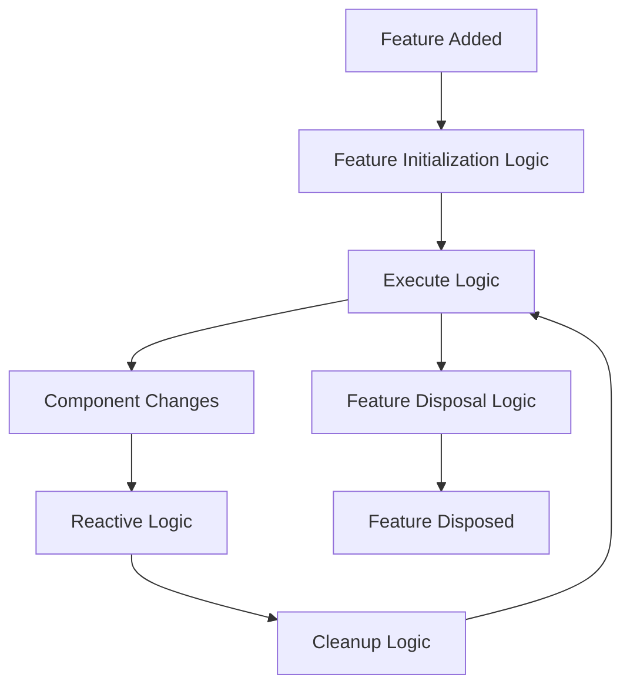

# Kinora Flow - Event Driven State Management


[](https://codecov.io/gh/kinora-app-br/kinora_flow)
[](https://choosealicense.com/licenses/mit/)
[](https://flutter.dev)
[](https://dart.dev)

A powerful and flexible **Event Driven State Management** pattern implementation for Flutter applications. This package provides a reactive state management solution that promotes clean architecture, separation of concerns, and scalable application development, based on the work of  [Event-Component-System](https://github.com/FlameOfUdun/flutter_event_component_system) by [Ehsan Rashidi](https://github.com/FlameOfUdun).

## 🌟 Features

### Core Architecture

- **🏗️ Event-Driven Architecture**: Clean separation between data (`FlowState`, where the app state is hold), behavior (`FlowLogic`, where business logic takes place), and events (`FlowEvent`, where communication occurs)
- **⚡ Reactive Programming**: Automatic UI updates when `FlowState` changes
- **🔄 Event-Driven**: Decoupled communication through events and reactive logic
- **🧬 Scoped Feature Management**: Features are inherited through nested `FlowScope` widgets, with automatic disposal when a scope is removed, so features can be scoped
- **🎯 Type-Safe**: Full type safety with Dart generics
- **🧩 Modular Design**: Organize code into reusable features

### Advanced Capabilities

- **🔍 Built-in Inspector**: Real-time debugging and visualization tools
- **📊 Flow Analysis**: Detect circular dependencies and cascade flows
- **📈 Performance Monitoring**: Track logic interactions and component changes
- **📝 Comprehensive Logging**: Detailed logic activity tracking

### Developer Experience

- **🛠️ Widget Integration**: Seamless Flutter widget integration
- **🎨 Reactive Widgets**: Automatic rebuilds on component changes
- **🔧 Debugging Tools**: Visual inspector with filtering and search
- **📋 Cascade Analysis**: Understand data flow and dependencies
- **⚙️ Hot Reload Support**: Full development workflow integration

## 🚀 Quick Start

### Installation

Add this package to your `pubspec.yaml`:

```yaml
dependencies:
  kinora_flow: ^1.0.0
```

### Basic Usage

#### 1. Define FlowStates and Events

```dart
// FlowStates hold state data
class CounterState extends FlowState<int> {
  CounterState([super.value = 0]);
}

// Events trigger actions
class IncrementEvent extends FlowEvent {
  IncrementEvent();
}
```

#### 2. Create Reactive Logic

```dart
// Logic define behavior and reactions
class IncrementCounterLogic extends FlowReactiveLogic {
  IncrementCounterLogic();

  // What triggers this logic?
  @override
  Set<Type> get reactsTo => {IncrementEvent};
  
  // What is changed by this logic?
  @override
  Set<Type> get interactsWith => {CounterState};

  // Business logic
  @override
  void react() {
    final counter = manager.getComponent<CounterState>();

    counter.update(counter.value + 1);
  }
}
```

#### 3. Organize into Features

```dart
class CounterFeature extends Feature {
  CounterFeature() {
    // Add components (States and Events)
    addComponents({
      CounterState(),
      IncrementEvent(),
    });
    
    // Add logic
    addLogic(IncrementCounterLogic());
  }
}
```

#### 4. Setup Flow Scope

```dart
class MyApp extends StatelessWidget {
  @override
  Widget build(BuildContext context) {
    return FlowScope(
      features: {
        CounterFeature(),
      },
      child: MaterialApp(
        home: CounterPage(),
      ),
    );
  }
}
```

#### 5. Create Reactive Widgets

```dart
class CounterPage extends FlowWidget {
  @override
  Widget build(BuildContext context, FlowContext flow) {
    // Watch state changes
    final counter = flow.watch<CounterState>();
    // Get references to events
    final incrementEvent = flow.get<IncrementEvent>();
    
    return Scaffold(
      appBar: AppBar(title: Text("Counter")),
      body: Center(
        child: Text("Count: ${counter.value}"),
      ),
      floatingActionButton: FloatingActionButton(
        // Trigger events (which will run all logic that 
        // `ractsTo` this event)
        onPressed: incrementEvent.trigger,
        child: Icon(Icons.add),
      ),
    );
  }
}
```

## 🏛️ Architecture Overview

### Core Concepts

#### **Components**

Base building blocks that can be either FlowStates or FlowEvents:

- **FlowState**: Hold state data with automatic change notification
- **FlowEvent**: Trigger actions and logic reactions

#### **Logic**

Define behavior and business logic:

- **FlowFeatureInitializationLogic**: Setup tasks on feature initialization
- **FlowFrameExecutionLogic**: Frame-based continuous execution
- **FlowReactiveLogic**: React to component changes
- **FlowCleanUpLogic**: Cleanup tasks after each frame
- **FlutterFeatureDisposalLogic**: Cleanup on feature disposal

#### **Features**

Organize related components and logic into cohesive modules:

```dart
class UserAuthFeature extends Feature {
  UserAuthFeature() {
    // States
    addComponents({
      AuthState(),
      LoginCredentialsState()
    });
    
    // Events  
    addComponents({
      LoginEvent(),
      LogoutEvent(),
    });
    
    // Logic
    addLogics({
      LoginUserReactiveLogic(),
      LogoutUserReactiveLogic(),
    });
  }
}
```

#### **Manager**

Central coordinator that:

- Manages all features and their lifecycles
- Coordinates logic execution
- Handles component change notifications
- Provides component lookup and access

### Logic Lifecycle



## 🎯 Advanced Features

### Scoped Feature Management

Kinora Flow introduces true support for scoping features. When you nest `FlowScope` widgets, child scopes automatically inherit all features from their parent scopes.

This allows for a powerful and organized way to manage feature visibility and lifecycle. Features added to a specific `FlowScope` are automatically disposed of when that scope is popped from the widget tree, preventing memory leaks and ensuring a clean state.

**Example of Nested Scopes:**

```dart
// Root scope with a core feature
FlowScope(
  features: {CoreFeature()},
  child: SomeWidget(
    child: Builder(
      builder: (context) {
        // Nested scope for a specific part of the app
        return FlowScope(
          features: {DashboardFeature()},
          child: DashboardPage(), // DashboardPage can access both CoreFeature and DashboardFeature
        );
      },
    ),
  ),
);
```

In this example, `DashboardPage` and its children can access components, events, and logic from both `CoreFeature` and `DashboardFeature`. When the nested `FlowScope` is removed from the tree, `DashboardFeature` and all its resources will be disposed of automatically.

### Reactive Widget Integration

#### FlowWidget

Automatically rebuilds when watched components change:

```dart
class ProfileWidget extends FlowWidget {
  @override
  Widget build(BuildContext context, FlowContext flow) {
    final user = flow.watch<UserState>();
    final auth = flow.watch<AuthState>();
    
    return Column(
      children: [
        Text("Welcome ${user.value.name}"),
        Text("Status: ${auth.value}"),
      ],
    );
  }
}
```

#### FlowBuilder

Functional approach for simple reactive widgets:

```dart
FlowBuilder<UserState>(
  builder: (context, flow) {
    final user = flow.watch<UserState>();

    return Text("Hello ${user.value.name}");
  },
)
```

#### FlowStatefulWidget

For complex widgets requiring local state (ex.: `TextEditingController`):

```dart
class ComplexWidget extends FlowStatefulWidget {
  @override
  State<ComplexWidget> createState() => _ComplexWidgetState();
}

class _ComplexWidgetState extends FlowStatefulWidgetState<ComplexWidget> {
  @override
  Widget build(BuildContext context) {
    final data = flow.watch<DataState>();

    return YourComplexWidget(data: data.value);
  }
}
```

### Event Handling and Listeners

#### Direct Event Listening

```dart
class NotificationWidget extends FlowWidget {
  @override
  Widget build(BuildContext context, FlowContext flow) {
    // Listen to specific events
    flow.listen<ErrorEvent>((error) {
      ScaffoldMessenger.of(context).showSnackBar(
        SnackBar(content: Text(error.value.message)),
      );
    });
    
    return YourWidget();
  }
}
```

#### Lifecycle Callbacks

```dart
class LifecycleWidget extends FlowWidget {
  @override
  Widget build(BuildContext context, FlowContext flow) {
    flow.onEnter(() {
      print("Widget entered Flow context");
    });
    
    flow.onExit(() {
      print("Widget exited Flow context");
    });
    
    return YourWidget();
  }
}
```

### Logic Types and Usage

#### FlowReactiveLogic

Respond to component changes:

```dart
class ValidationLogic extends FlowReactiveLogic {
  ValidationLogic();

  @override
  Set<Type> get reactsTo => {FormDataState};
  
  @override
  Set<Type> get interactsWith => {ValidationState};
  
  @override
  bool get reactsIf => true; // Conditional reactions
  
  @override
  void react() {
    final formData = manager.getComponent<FormDataState>();
    final validation = manager.getComponent<ValidationState>();
    
    // Validate form data
    final isValid = validateForm(formData.value);

    validation.update(isValid);
  }
}
```

#### ExecuteLogic

Continuous frame-based execution:

```dart
class TimerLogic extends FlowFrameExecutionLogic {
  TimerLogic();

  @override
  Set<Type> get interactsWith => {TimerState};
  
  @override
  void execute(Duration elapsed) {
    final timer = manager.getComponent<TimerState>();

    timer.update(timer.value + elapsed.inMilliseconds);
  }
}
```

#### Initialize/Dispose Logic

Setup and cleanup:

```dart
class DatabaseInitLogic extends FlowFeatureInitializationLogic {
  @override
  Set<Type> get interactsWith => {DatabaseState};
  
  @override
  void initialize() {
    // Initialize database connection
    print("Database initialized");
  }
}

class DatabaseDisposalLogic extends FlutterFeatureDisposalLogic {
  @override
  Set<Type> get interactsWith => {DatabaseState};
  
  @override
  void dispose() {
    // Close database connection
    print("Database closed");
  }
}
```

## 🔍 Debugging and Inspection

### Inspector

Real-time debugging interface with four main views:

#### **Summary View**

- Cascade analysis and flow detection
- Circular dependency warnings
- Logic interaction overview
- Performance metrics

#### **Components View**

- Live component inspection
- FlowState value monitoring  
- Event triggering interface
- Filtering by feature and type

#### **Logs View**

- Logic reaction tracking
- Component change history
- Filterable log levels
- Stack trace analysis

### Inspector Integration

```dart
MaterialApp(
  home: YourHomePage(),
  builder: (context, child) {
    return Row(
      children: [
        Expanded(child: child ?? SizedBox()),
        Expanded(child: Inspector()), // Add inspector
      ],
    );
  },
)
```

### Custom Inspector Widgets

Components can provide custom inspector representations:

```dart
class UserState extends FlowState<User> {
  UserState(super.value);
  
  @override
  Widget buildInspector(BuildContext context) {
    return Column(
      crossAxisAlignment: CrossAxisAlignment.start,
      children: [
        Text("Name: ${value.name}"),
        Text("Email: ${value.email}"),
        Text("Role: ${value.role}"),
      ],
    );
  }
}
```

### Logging and Analysis

#### Custom Logging

```dart
// Log custom events
Logger.log(CustomLog(
  time: .now(),
  level: .info,
  message: "Custom event occurred",
  stack: .current,
));
```

#### Cascade Analysis

```dart
final manager = FlowScope.of(context);
final analysis = Analyzer.analyze(manager);

// Get cascade flows
final flows = analysis.getCascadeFlowsFrom(UserLoginEvent);

// Check for circular dependencies
final circular = analysis.getCircularDependencies();

// Validate logic health
final issues = analysis.validateCascadeLogic();
```

## 📊 Real-World Example

### User Authentication System

```dart
// States
class AuthState extends FlowState<Auth> {
  AuthState() : super(Auth.unauthenticated);
}

class LoginCredentialsState extends FlowState<LoginCredentials> {
  LoginCredentialsState() : super(LoginCredentials.empty());
}

// Events
class LoginEvent extends FlowEvent {
  LoginEvent();
}

class LogoutEvent extends FlowEvent {
  LogoutEvent();
}

// Logic
class LoginUserReactiveLogic extends FlowReactiveLogic {
  LoginUserReactiveLogic();

  @override
  Set<Type> get reactsTo => {LoginEvent};
  
  @override
  Set<Type> get interactsWith => {AuthState, LoginCredentialsState};

  @override
  void react() async {
    final credentials = manager.getComponent<LoginCredentialsState>();
    final authState = manager.getComponent<AuthState>();
    
    try {
      authState.update(Auth.loading);
      
      final user = await authenticateUser(credentials.value);
      authState.update(Auth.authenticated(user));
      
    } catch (error) {
      authState.update(Auth.error(error.toString()));
    }
  }
}

// Feature
class UserAuthFeature extends Feature {
  UserAuthFeature() {
    addComponents({
      AuthState(),
      LoginCredentialsState(),
      LoginEvent(),
      LogoutEvent(),
    });
    
    addLogics({
      LoginUserReactiveLogic(),
      LogoutUserReactiveLogic(),
    });
  }
}

// UI Integration
class LoginPage extends FlowWidget {
  @override
  Widget build(BuildContext context, FlowContext flow) {
    final authState = flow.watch<AuthState>();
    final credentials = flow.get<LoginCredentialsState>();
    final loginEvent = flow.get<LoginEvent>();
    
    return Scaffold(
      appBar: AppBar(title: Text("Login")),
      body: Column(
        children: [
          if (authState.value.isLoading)
            CircularProgressIndicator(),
            
          TextField(
            onChanged: (value) {
              credentials.update(
                credentials.value.copyWith(email: value)
              );
            },
            decoration: InputDecoration(labelText: "Email"),
          ),
          
          ElevatedButton(
            onPressed: authState.value.isLoading ? null : loginEvent.trigger,
            child: Text("Login"),
          ),
          
          if (authState.value.hasError)
            Text(
              authState.value.error,
              style: TextStyle(color: Colors.red),
            ),
        ],
      ),
    );
  }
}
```

## 🧪 Testing

### Testing States

```dart
test('state notifies listeners on change', () {
  final state = TestState();
  bool notified = false;
  
  state.addListener(TestListener(() => notified = true));
  state.update(42);
  
  expect(notified, isTrue);
  expect(state.value, equals(42));
});
```

### Testing Logic

```dart
test('reactive logic processes events', () {
  final manager = Manager();
  final feature = TestFeature();
  final logic = TestReactiveLogic();
  
  feature.addComponent(TestEvent());
  feature.addLogic(logic);
  manager.addFeature(feature);
  
  manager.getComponent<TestEvent>().trigger();
  
  expect(logic.reacted, isTrue);
});
```

### Testing Features

```dart
test('feature manages components and logic', () {
  final feature = TestFeature();
  final state = TestState();
  final logic = TestLogic();
  
  feature.addComponent(state);
  feature.addLogic(logic);
  
  expect(feature.components, contains(state));
  expect(feature.reactiveLogics[TestEvent], contains(logic));
});
```

### Widget Testing

```dart
testWidgets('Flow widget rebuilds on state change', (tester) async {
  await tester.pumpWidget(
    FlowScope(
      features: {TestFeature()},
      child: TestFlowWidget(),
    ),
  );
  
  final state = FlowScope.of(tester.element(find.byType(TestFlowWidget)))
      .getComponent<TestState>();
  
  state.update(100);
  await tester.pump();
  
  expect(find.text('100'), findsOneWidget);
});
```

## 📚 API Reference

### Core Classes

#### `Component`

Base class for all components in the system.

**Key Methods:**

- `addListener(ComponentListener listener)` - Add change listener
- `removeListener(ComponentListener listener)` - Remove listener
- `buildInspector(BuildContext context)` - Custom inspector widget

#### `FlowState<T>`

Stateful component that holds data of type `T`.

**Key Methods:**

- `update(T value, {bool notify = true})` - Update state value
- `get value` - Current state value
- `get previous` - Previous state value

#### `FlowEvent`

Stateless component for triggering actions.

**Key Methods:**

- `trigger()` - Fire the event and notify listeners

#### `FlowFeature`

Container for organizing related components and logic.

**Key Methods:**

- `addComponent(Component component)` - Add component to feature
- `addComponents(Set<Component> components)` - Add multiple components
- `addLogic(Logic logic)` - Add logic to feature
- `addLogics(Set<Logic> logics)` - Add multiple logics to feature
- `getComponent<T extends Component>()` - Retrieve component by type

#### `FlowManager`

Central coordinator for the entire system.

**Key Methods:**

- `addFeature(Feature feature)` - Add feature to manager
- `getComponent<T extends Component>()` - Get component from any feature
- `initialize()` - Initialize all features
- `teardown()` - Cleanup all features

#### `FlowContext`

Widget-level interface for system access.

**Key Methods:**

- `get<T extends Component>()` - Get component without watching
- `watch<T extends Component>()` - Watch component for changes
- `listen<T extends Component>(Function(T) listener)` - Listen to component changes
- `onEnter(Function() callback)` - Widget lifecycle callback
- `onExit(Function() callback)` - Widget disposal callback

### Logic Types

#### `FlowReactiveLogic`

Responds to component changes.

**Abstract Members:**

- `Set<Type> get reactsTo` - Component types that trigger this logic
- `Set<Type> get interactsWith` - Component types this logic modifies
- `bool get reactsIf` - Conditional reaction logic
- `void react()` - Reaction implementation

#### `FlowFrameExecutionLogic`

Runs continuously every frame.

**Abstract Members:**

- `Set<Type> get interactsWith` - Component types this logic uses
- `void execute(Duration elapsed)` - Execution implementation

#### `FlowFeatureInitializationLogic`

Runs once during feature initialization.

**Abstract Members:**

- `Set<Type> get interactsWith` - Component types this logic sets up
- `void initialize()` - Initialization implementation

#### `FlutterFeatureDisposalLogic`

Runs once during feature disposal.

**Abstract Members:**

- `Set<Type> get interactsWith` - Component types this logic cleans up
- `void dispose()` - Disposal implementation

#### `FlowCleanUpLogic`

Runs after each frame execution.

**Abstract Members:**

- `Set<Type> get interactsWith` - Component types this logic cleans
- `void cleanup()` - Cleanup implementation

### Widget Classes

#### `FlowScope`

Provides scoped Flow context to widget tree.

**Constructor:**

```dart
FlowScope({
  required Set<Feature> features,
  required Widget child,
})
```

#### `FlowWidget`

Base class for reactive widgets.

**Abstract Members:**

```dart
Widget build(BuildContext context, FlowContext flow);
```

#### `FlowBuilder<T>`

Functional reactive widget builder.

**Constructor:**

```dart
FlowBuilder({
  required Widget Function(BuildContext, FlowContext) builder,
})
```

#### `FlowStatefulWidget`

Base class for complex reactive widgets with local state.

**Usage:**

```dart
class MyWidget extends FlowStatefulWidget {
  @override
  State<MyWidget> createState() => _MyWidgetState();
}

class _MyWidgetState extends FlowStatefulWidgetState<MyWidget> {
  @override
  Widget build(BuildContext context) {
    final data = flow.watch<DataState>();
    return YourWidget(data: data.value);
  }
}
```

### Analysis and Debugging

#### `Analyzer`

Static analysis of system structure.

**Key Methods:**

- `static Analysis analyze(Manager manager)` - Analyze system
- Analysis methods for cascade flows and circular dependencies

#### `Inspector`

Visual debugging interface.

**Constructor:**

```dart
Inspector({
  Duration refreshDelay = const Duration(milliseconds: 100),
})
```

#### `Logger`

System activity logging.

**Key Methods:**

- `static void log(Log log)` - Add custom log entry
- `static void clear()` - Clear all logs
- `static List<Log> get entries` - Access log history

## 🔧 Configuration

### Logger Configuration

```dart
// Set maximum log entries
Logger.maxEntries = 2000;

// Custom log levels
class CustomLog extends Log {
  final String message;
  
  const CustomLog({
    required this.message,
    required super.time,
    required super.level,
    required super.stack,
  });

  @override
  String get description => message;
}
```

### Inspector Customization

```dart
// Custom refresh rate
Inspector(
  refreshDelay: Duration(milliseconds: 50),
)

// Component-specific inspector widgets
class UserState extends FlowState<User> {
  UserState(super.value);
  
  @override
  Widget buildInspector(BuildContext context) {
    return Card(
      child: ListTile(
        leading: CircleAvatar(
          backgroundImage: NetworkImage(value.avatarUrl),
        ),
        title: Text(value.name),
        subtitle: Text(value.email),
        trailing: Chip(label: Text(value.role)),
      ),
    );
  }
}
```

## 🎯 Best Practices

### 1. **Feature Organization**

```dart
// ✅ Good: Organized by domain
features/
  user_auth_feature/
    states/
    events/
    logic/
    user_auth_feature.dart
  
// ❌ Avoid: Mixing concerns
features/
  all_states.dart
  all_events.dart
  all_logic.dart
```

### 2. **FlowState Design**

```dart
// ✅ Good: Immutable data structures
class UserState extends FlowState<User> {
  UserState(super.value);
  
  void updateName(String name) {
    update(value.copyWith(name: name));
  }
}

// ❌ Avoid: Mutable data
class UserState extends FlowState<User> {
  UserState(super.value);
  
  void updateName(String name) {
    value.name = name; // Don't mutate directly
    notifyListeners(); // Manual notification
  }
}
```

### 3. **Logic Granularity**

```dart
// ✅ Good: Single responsibility
class ValidateEmailLogic extends FlowReactiveLogic {
  @override
  Set<Type> get reactsTo => {EmailState};
  
  @override
  void react() {
    // Only validate email
  }
}

class ValidatePasswordLogic extends FlowReactiveLogic {
  @override
  Set<Type> get reactsTo => {PasswordState};
  
  @override
  void react() {
    // Only validate password
  }
}

// ❌ Avoid: Multiple responsibilities
class ValidateEverythingLogic extends FlowReactiveLogic {
  @override
  void react() {
    // Validate email, password, phone, etc.
  }
}
```

### 4. **Error Handling**

```dart
// ✅ Good: Proper error handling
class LoginLogic extends FlowReactiveLogic {
  @override
  void react() async {
    try {
      final result = await authService.login();

      authState.update(AuthState.authenticated(result));
    } catch (error) {
      errorState.update(ErrorState.fromException(error));
    }
  }
}
```

### 5. **Testing Strategy**

```dart
// ✅ Good: Test logic in isolation
test('login logic authenticates user', () async {
  final manager = Manager();
  final feature = TestAuthFeature();

  manager.addFeature(feature);
  
  final loginEvent = manager.getComponent<LoginEvent>();
  final authState = manager.getComponent<AuthState>();
  
  loginEvent.trigger();
  
  expect(authState.value, equals(AuthState.authenticated));
});
```

## 🚀 Performance Tips

### 1. **Minimize Reactive Logic Scope**

```dart
// ✅ Good: Specific reactsTo
class UserProfileLogic extends FlowReactiveLogic {
  @override
  Set<Type> get reactsTo => {UserProfileState};
}

// ❌ Avoid: Broad reactsTo
class UserProfileLogic extends FlowReactiveLogic {
  @override
  Set<Type> get reactsTo => {UserState, ProfileState, SettingsState};
}
```

### 2. **Use Conditional Reactions**

```dart
class ExpensiveLogic extends FlowReactiveLogic {
  @override
  bool get reactsIf => shouldProcess();
  
  bool shouldProcess() {
    // Only react under specific conditions
    return manager.getComponent<ConfigState>().value.enableExpensiveProcessing;
  }
}
```

### 3. **Optimize Widget Watching**

```dart
// ✅ Good: Watch only what you need
class UserWidget extends FlowWidget {
  @override
  Widget build(BuildContext context, FlowContext flow) {
    final userName = flow.watch<UserNameState>();
    final userAvatar = flow.get<UserAvatarState>(); // No rebuild on avatar change
    
    return ListTile(
      title: Text(userName.value),
      leading: CircleAvatar(backgroundImage: userAvatar.value),
    );
  }
}
```

### 4. **Batch State Updates**

```dart
// ✅ Good: Batch updates
void updateUserProfile(UserProfile profile) {
  userNameState.update(profile.name, notify: false);
  userEmailState.update(profile.email, notify: false);
  userAvatarState.update(profile.avatar); // Only this triggers rebuild
}
```

## 🤝 Contributing

We welcome contributions!

## 📄 License

This project is licensed under the MIT License - see the [LICENSE](LICENSE) file for details.

## 🙏 Acknowledgments

- Inspired by the Entity-Component-System pattern from game development built by [Ehsan Rashidi](https://github.com/FlameOfUdun)
- Built for the Flutter community with ❤️
- Special thanks to all contributors and users and for Ehsan Rashidi

## 📞 Support

- **Issues**: [GitHub Issues](https://github.com/kinora-app-br/kinora_flow/issues)
- **Discussions**: [GitHub Discussions](https://github.com/kinora-app-br/kinora_flow/discussions)

